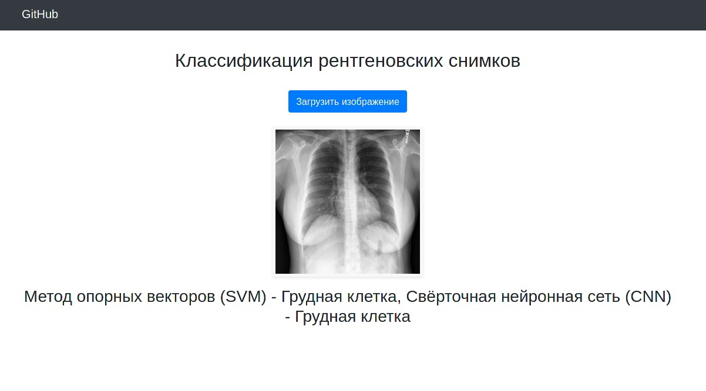
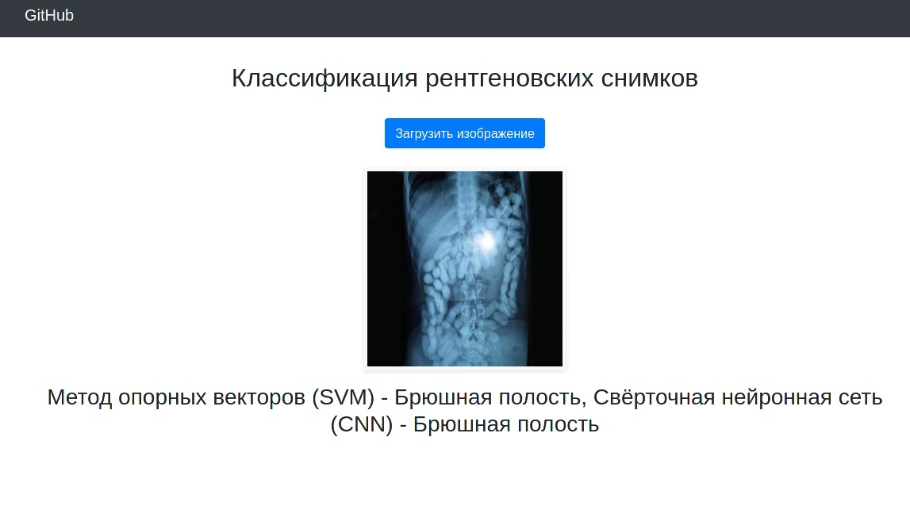

 # О проекте
Проект представляет собой веб-приложение, которое классифицирует рентгеновские снимки (брюшная полость или грудная клетка) с помощью двух моделей SVM и CNN. Также в проекте присутсвуют файлы для оценки этих моделей ROC-кривыми.

 

__Требования:__
1. Tensorflow 2.2
2. matplotlib
3. sklearn
4. skimage
5. Flask
6. pandas
7. keras
8. numpy
9. PIL 

  

 
